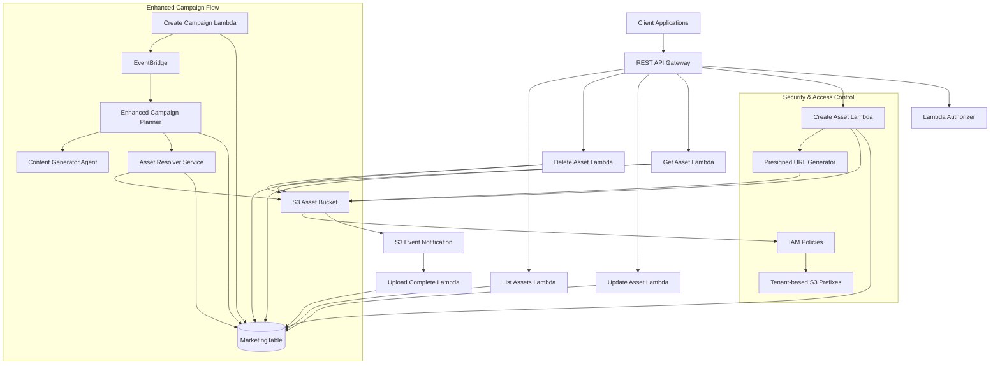

# Campaign Asset Management Design Document

## Overview

The Campaign Asset Management system extends the existing Social Media Marketing Campaign Builder with comprehensive asset management capabilities. The system enables users to upload, organize, and strategically utilize visual and media assets within campaigns through a dual-asset model supporting both internal (S3-stored) and external (URL-referenced) assets.

The design emphasizes security, tenant isolation, and seamless integration with existing campaign workflows. The system leverages AWS Lambda for serverless compute, Amazon S3 for secure asset storage, and DynamoDB for metadata management, following established archectural patterns. The campaign planner agent is enhanced to strategically incorporate assets into content generation, weighing heavily toward using each asset exactly once per campaign for optimal visual impact.

## Architecture

### System Architecture

The Campaign Asset Management system extends the existing infrastructure with new Lambda functions and S3 integration:



### Integration Architecture

**Shared Infrastructure Extensions**
- **S3 Bucket**: New dedicated bucket for asset storage with tenant-isolated prefixes
- **DynamoDB Table**: Extends existing MarketingTable with asset entities using type-prefixed SKs
- **API Gateway**: Adds new `/assets` endpoints to existing CampaignApi
- **EventBridge**: Leverages existing event bus for asset-aware campaign workflows

**Security Architecture**
- **Tenant Isolation**: S3 object keys prefixed with `{tenantId}/assets/` for complete data segregation
- **Presigned URLs**: Time-limited, secure upload URLs with content-type and size restrictions
- **IAM Policies**: Least-privilege access for Lambda functions with tenant-scoped S3 permissions
- **Content Validation**: Server-side validation of uploaded content types and sizes

### Asset Storage Strategy

**Internal Assets (S3-based)**
```
S3 Key Structure: {tenantId}/assets/{assetId}.{extension}
```

**Security Features**
- Tenant-isolated S3 prefixes prevent cross-tenant access
- Presigned URLs with 15-minute expiration for secure uploads
- Content-Type validation enforced at both client and server levels
- File size limits: 10MB for images, 100MB for videos
- Server-side encryption with AWS managed keys

**External Assets (URL-based)**
- HTTPS-only URLs for security compliance
- No local storage or caching to respect external resource ownership
- URL validation and accessibility checking during creation
- Metadata-only storage in DynamoDB

## Components and Interfaces

### Core Components

#### 1. Asset Management Service
- **Purpose**: Manages asset CRUD operations and metadata
- **Responsibilities**: Asset creation, updates, validation, presigned URL generation
- **Interface**: REST API endpoints for asset management
- **Dependencies**: DynamoDB, S3, IAM

#### 2. Asset Upload Service
- **Purpose**: Handles secure asset upload workflows and completion processing
- **Responsibilities**: Presigned URL generation, S3 event handling, upload status updates
- **Interface**: S3 event-driven Lambda for upload completion processing
- **Dependencies**: S3, DynamoDB, S3 event notifications

#### 3. Asset Resolver Service
- **Purpose**: Provides asset access and URL generation for content generation
- **Responsibilities**: Secure URL generation, asset metadata retrieval, access control
- **Interface**: Internal service for campaign planner and content generator
- **Dependencies**: S3, DynamoDB, IAM

#### 4. Enhanced Campaign Planner
- **Purpose**: Strategically incorporates assets into campaign content plans
- **Responsibilities**: Asset-content matching, strategic distribution, utilization optimization
- **Interface**: Enhanced agent with asset-aware planning capabilities
- **Dependencies**: Asset Resolver Service, existing campaign infrastructure

### API Endpoints

The following endpoints extend the existing API Gateway:

```
POST   /assets                    # Create internal asset metadata in DDB and return presigned upload URL
GET    /assets/{assetId}          # Retrieve internal asset metadata and access URL
PUT    /assets/{assetId}          # Update internal asset description and metadata
DELETE /assets/{assetId}          # Delete internal asset and associated S3 objects
GET    /assets                    # List and filter internal assets with pagination
```

### Asset Upload Workflow

**Internal Asset Creation Flow:**
1. `POST /assets` creates asset metadata in DynamoDB with `uploadStatus: 'pending'` and 1-hour TTL
2. Returns presigned S3 upload URL with 15-minute expiration
3. Client uploads directly to S3 using presigned URL
4. S3 event triggers Lambda function on successful upload
5. Lambda removes TTL and updates `uploadStatus: 'completed'`
6. Failed uploads automatically expire after 1 hour via TTL

**External Asset Usage:**
- External assets are defined ad-hoc within campaign creation
- No separate API endpoints needed for external assets
- Validation occurs during campaign creation process

### Enhanced Campaign Integration

**Campaign Creation Enhancement**
```javascript
// Extended campaign creation payload
{
  // ... existing campaign fields
  assets: [
    {
      assetId: 'asset_123',
      type: 'internal'
    },
    {
      type: 'external',
      url: 'https://example.com/image.jpg',
      description: 'Product hero image for campaign',
      contentType: 'image/jpeg'
    }
  ]
}
```

**Asset-Aware Planning**
- Campaign planner analyzes asset descriptions and content types
- Strategic asset-to-post matching based on topic relevance and platform requirements
- Preference for using each asset exactly once unless campaign length requires reuse
- Graceful handling of insufficient assets by generating posts without forced asset usage

## Data Models

### Asset Entity

```javascript
{
  // DynamoDB Keys
  pk: `${tenantId}#${assetId}`,
  sk: 'asset',
  GSI1PK: `${tenantId}`,
  GSI1SK: `ASSET#${contentType}#${createdAt}`,
  GSI2PK: `${tenantId}`,
  GSI2SK: `ASSET#${createdAt}`,

  // Asset Identity
  assetId: 'string',
  tenantId: 'string',
  type: 'internal', // Only internal assets are stored as entities

  // Asset Metadata
  contentType: 'string', // MIME type (image/jpeg, video/mp4, etc.)
  description: 'string', // 10-500 characters
  fileSize: 'number', // bytes

  // Internal Asset Fields
  objectKey: 'string', // S3 object key: {tenantId}/assets/{assetId}.{extension}
  fileExtension: 'string', // File extension (jpg, png, mp4, etc.)
  uploadStatus: 'pending | completed | failed',
  uploadUrl: 'string | null', // Presigned upload URL (temporary)
  ttl: 'number | null', // TTL for pending uploads (1 hour from creation)

  // Usage Tracking
  usageStats: {
    totalCampaigns: 'number',
    totalPosts: 'number',
    lastUsedAt: 'string | null'
  },

  // Metadata
  createdAt: 'string',
  updatedAt: 'string',
  version: 'number'
}
```

### Campaign Asset Association

```javascript
{
  // DynamoDB Keys (stored within campaign entity)
  pk: `${tenantId}#${campaignId}`,
  sk: 'campaign',

  // ... existing campaign fields

  // Asset Collection
  assets: [
    {
      assetId: 'string',
      type: 'internal',
      addedAt: 'string'
    },
    {
      type: 'external',
      url: 'string',
      description: 'string',
      contentType: 'string',
      addedAt: 'string'
    }
  ] | null
}
```

### Enhanced Social Post Entity

```javascript
{
  // ... existing post fields

  // Asset Assignment (added by planner)
  assignedAsset: {
    assetId: 'string',
    type: 'internal | external',
    accessUrl: 'string', // Generated by Asset Resolver
    assignedAt: 'string'
  } | null
}
```

### DynamoDB Access Patterns

**Asset Operations**
```
# Create/Get/Update Asset
PK: {tenantId}#{assetId}
SK: 'asset'

# List Assets by Tenant (chronological)
GSI1PK: {tenantId}
GSI1SK: 'ASSET#{contentType}#{createdAt}'

# Filter Assets by Type
GSI2PK: {tenantId}
GSI2SK: 'ASSET#{type}#{createdAt}'
```

**Campaign Asset Queries**
```
# Get Campaign with Assets
PK: {tenantId}#{campaignId}
SK: 'campaign'

# Asset Usage Tracking (via usage stats in asset entity)
PK: {tenantId}#{assetId}
SK: 'asset'
```

## Correctness Properties

*A property is a characteristic or behavior that should hold true across all valid executions of a system-essentially, a formal statement about what the system should do. Properties serve as the bridge between human-readable specifications and machine-verifiable correctness guarantees.*

Before writing the correctness properties, I need to analyze the acceptance criteria for testability:

<function_calls>
<invoke name="prework">
<parameter name="featureName">campaign-asset-management

After reviewing the prework analysis, several properties can be consolidated to eliminate redundancy:

**Property Reflection:**
- Properties 1.1, 1.2, 1.3, 1.4, 1.5 can be combined into a comprehensive "internal asset creation workflow" property
- Properties 2.1, 2.2, 2.3, 2.4 can be consolidated into a single "external asset management" property
- Properties 3.1, 3.2, 3.3, 3.4 can be merged into one "asset description management" property
- Properties 4.1, 4.2, 4.3, 4.4 can be combined into a "campaign asset integration" property
- Properties 5.1, 5.2, 5.3, 5.4, 5.5 can be consolidated into a "strategic aszation" property
- Properties 6.1, 6.2, 6.3, 6.4, 6.5 can be merged into an "asset lifecycle management" property
- Properties 7.1, 7.2, 7.3, 7.4 can be combined into a "content generation asset integration" property
- Properties 8.1, 8.2, 8.3, 8.4 can be consolidated into an "asset analytics and optimization" property
- Properties 9.1, 9.2, 9.3, 9.4 can be merged into a "security and access control" property
- Properties 10.1, 10.2, 10.3, 10.4 can be combined into a "campaign workflow integration" property

**Property 1: Internal asset creation workflow**
*For any* internal asset upload request, the system should generate presigned URLs with proper content type validation (image/jpeg, image/png, image/gif, image/webp, video/mp4, video/mov, video/avi), enforce size limits (10MB for images, 100MB for videos), create unique tenant-isolated object keys, and store complete metadata upon upload completion
**Validates: Requirements 1.1, 1.2, 1.3, 1.4, 1.5**

**Property 2: External asset management**
*For any* external asset creation, the system should validate HTTPS URL format and accessibility, capture all required metadata (URL, content type, description), and avoid local storage or caching operations
**Validates: Requirements 2.1, 2.2, 2.3, 2.4**

**Property 3: Asset description management**
*For any* asset creation or update, the system should require descriptions between 10-500 characters, include descriptions in all metadata responses, and allow description modifications while preserving immutable fields
**Validates: Requirements 3.1, 3.2, 3.3, 3.4**

**Property 4: Campaign asset integration**
*For any* campaign creation with assets, the system should accept optional asset arrays, validate asset references and tenant ownership, maintain associations without metadata duplication, and provide asset metadata to the campaign planner
**Validates: Requirements 4.1, 4.2, 4.3, 4.4**

**Property 5: Strategic asset utilization**
*For any* campaign with assets, the planner should analyze asset descriptions and content types, prioritize using each asset exactly once unless campaign length requires reuse, match assets to posts based on platform requirements and topics, include asset references in post metadata, and generate posts without assets when collections are insufficient
**Validates: Requirements 5.1, 5.2, 5.3, 5.4, 5.5**

**Property 6: Asset lifecycle management**
*For any* asset management operation, the system should provide paginated listing with filtering, allow description updates while preserving immutable fields, handle deletion appropriately (removing S3 objects for internal assets while protecting assets referenced by active campaigns), and provide complete metadata including usage statistics
**Validates: Requirements 6.1, 6.2, 6.3, 6.4, 6.5**

**Property 7: Content generation asset integration**
*For any* content generation with assigned assets, the system should provide asset URLs, descriptions, and content types to agents, generate secure time-limited URLs for internal assets, provide original URLs for external assets, and track utilization upon completion
**Validates: Requirements 7.1, 7.2, 7.3, 7.4**

**Property 8: Asset analytics and optimization**
*For any* asset usage in campaigns, the system should record usage statistics with campaign associations, maintain performance metrics, provide insights in reports, and identify underutilized assets for optimization recommendations
**Validates: Requirements 8.1, 8.2, 8.3, 8.4**

**Property 9: Security and access control**
*For any* asset operation, the system should implement tenant-based S3 key prefixes for isolation, create time-limited signed URLs with appropriate permissions, enforce tenant ownership verification, and scan uploaded content for security threats
**Validates: Requirements 9.1, 9.2, 9.3, 9.4**

**Property 10: Campaign workflow integration**
*For any* campaign execution with asset references, the system should validate asset availability before execution, ensure accessibility throughout generation, provide graceful fallback with clear error reporting, and update usage records with utilization feedback upon completion
**Validates: Requirements 10.1, 10.2, 10.3, 10.4**

## Error Handling

### API Error Responses

**Validation Errors (400)**
```javascript
{
  statusCode: 400,
  body: JSON.stringify({
    message: 'Invalid asset data',
    details: {
      field: 'contentType',
      issue: 'Unsupported content type. Must be one of: image/jpeg, image/png, image/gif, image/webp, video/mp4, video/mov, video/avi'
    }
  })
}
```

**File Size Errors (413)**
```javascript
{
  statusCode: 413,
  body: JSON.stringify({
    message: 'File size exceeds limit',
    details: {
      contentType: 'image/jpeg',
      maxSize: '10MB',
      providedSize: '15MB'
    }
  })
}
```

**Asset Not Found (404)**
```javascript
{
  statusCode: 404,
  body: JSON.stringify({
    message: 'Asset not found',
    assetId: 'asset_123'
  })
}
```

**Conflict Errors (409)**
```javascript
{
  statusCode: 409,
  body: JSON.stringify({
    message: 'Cannot delete asset referenced by active campaigns',
    assetId: 'asset_123',
    activeCampaigns: ['campaign_456', 'campaign_789']
  })
}
```

**S3 Upload Errors (422)**
```javascript
{
  statusCode: 422,
  body: JSON.stringify({
    message: 'Asset upload failed',
    details: {
      reason: 'Content type mismatch between presigned URL and uploaded file',
      expected: 'image/jpeg',
      received: 'image/png'
    }
  })
}
```

### Error Handling Strategy

- **Structured Responses**: Consistent error format with actionable details
- **Contextual Logging**: Log errors with asset, tenant, and operation context
- **Graceful Degradation**: Handle asset failures without breaking campaign workflows
- **Retry Logic**: Implement exponential backoff for transient S3 and DynamoDB failures
- **Circuit Breaker**: Protect against cascading failures in asset-dependent workflows

## Testing Strategy

### Dual Testing Approach

The Campaign Asset Management system requires both unit testing and property-based testing to ensure comprehensive coverage and correctness validation.

#### Unit Testing Requirements

Unit tests will verify specific examples, integration points, and error conditions:

- **API Endpoint Testing**: Verify each REST endpoint handles valid and invalid asset requests correctly
- **Presigned URL Generation**: Test S3 presigned URL creation with proper security parameters
- **Content Type Validation**: Test validation logic for supported and unsupported file formats
- **File Size Enforcement**: Test size limit enforcement for images (10MB) and videos (100MB)
- **S3 Integration**: Test S3 upload, download, and deletion operations with proper error handling
- **DynamoDB Operations**: Test asset metadata CRUD operations and query patterns
- **Tenant Isolation**: Test S3 key prefixing and access control enforcement

#### Property-Based Testing Requirements

Property-based tests will verify universal properties across all valid inputs using **fast-check** as the testing library. Each property-based test will run a minimum of 100 iterations to ensure comprehensive coverage.

Property-based tests must be tagged with comments explicitly referencing the correctness property:
- Format: `**Feature: campaign-asset-management, Property {number}: {property_text}**`
- Each correctness property will be implemented by a single property-based test
- Tests will generate random asset data, campaign configurations, and workflow scenarios
- Generators will create realistic asset definitions within valid constraints (content types, sizes, descriptions)

#### Integration Testing

- **End-to-End Asset Workflows**: Test complete asset upload, campaign integration, and content generation flows
- **Campaign Planner Integration**: Verify enhanced planner correctly incorporates assets into content plans
- **Cross-Service Integration**: Test integration with existing persona and brand management systems
- **Error Recovery**: Validate error handling and recovery mechanisms across asset workflows

### Testing Infrastructure

- **Test Data Generation**: Create realistic asset data generators for consistent testing
- **S3 Mock Services**: Mock S3 operations for isolated unit testing while preserving integration tests
- **Presigned URL Testing**: Test presigned URL generation and validation without actual S3 uploads
- **Performance Testing**: Validate API response times and throughput under load

## Performance Considerations

### S3 Optimization

#### Upload Performance
- **Presigned URLs**: Direct client-to-S3 uploads bypass Lambda payload limits and improve performance
- **Multipart Uploads**: Support for large video files through S3 multipart upload capability
- **Content-Type Validation**: Client-side validation reduces failed uploads and improves user experience
- **Upload Confirmation**: Asynchronous upload completion handling for better responsiveness

#### Access Performance
- **Signed URL Caching**: Cache signed URLs for internal assets with appropriate TTL (15 minutes)
- **CDN Integration**: Optional CloudFront distribution for frequently accessed assets
- **Regional Optimization**: S3 bucket placement in primary user regions for reduced latency

### DynamoDB Optimization

#### Query Patterns
- **GSI Design**: Efficient GSIs for content type and asset type filtering
- **Composite Sort Keys**: Enable range queries for asset creation date filtering
- **Projection Optimization**: Include frequently accessed fields in GSI projections

#### Write Performance
- **Batch Operations**: Use BatchWriteItem for bulk asset operations when possible
- **Hot Partition Avoidance**: Distribute writes using tenant ID and timestamp prefixes
- **Conditional Writes**: Use condition expressions to prevent race conditions in asset updates

### Memory and Timeout Configuration

```yaml
# Asset-specific Lambda configurations
AssetUploadFunction:
  Timeout: 30
  MemorySize: 512

AssetResolverFunction:
  Timeout: 15
  MemorySize: 256

EnhancedCampaignPlannerFunction:
  Timeout: 300
  MemorySize: 2048
```

## Security Considerations

### Data Protection

#### S3 Security
- **Bucket Policies**: Restrict access to tenant-specific prefixes using IAM conditions
- **Server-Side Encryption**: AWS managed keys (SSE-S3) for all stored assets
- **Presigned URL Security**: Time-limited URLs (15 minutes) with content-type restrictions
- **CORS Configuration**: Restrict cross-origin requests to authorized domains

#### Access Control
- **Tenant Isolation**: S3 object keys prefixed with tenant ID for complete data segregation
- **IAM Policies**: Least privilege access for Lambda functions with tenant-scoped permissions
- **API Gateway Authorization**: JWT token validation with tenant context extraction
- **Asset Ownership Validation**: Strict validation of asset ownership for all operations

### Content Security

#### Upload Validation
- **Content Type Verification**: Server-side validation of uploaded file content types
- **File Size Limits**: Enforce maximum file sizes to prevent abuse and cost overruns
- **Content Scanning**: Integration with AWS services for malware and content policy scanning
- **URL Validation**: HTTPS-only external URLs with accessibility verification

#### Data Privacy
- **Audit Trails**: Comprehensive logging of all asset operations for compliance
- **Data Retention**: Configurable retention policies for deleted assets
- **Cross-Border Compliance**: Regional S3 bucket placement for data sovereignty requirements

## Deployment and Operations

### Infrastructure as Code

The Campaign Asset Management system will be deployed using AWS SAM templates that extend the existing infrastructure:

```yaml
# Key additions to existing template
Resources:
  AssetBucket:
    Type: AWS::S3::Bucket
    Properties:
      BucketName: !Sub "${AWS::StackName}-assets-${AWS::AccountId}"
      PublicAccessBlockConfiguration:
        BlockPublicAcls: true
        BlockPublicPolicy: true
        IgnorePublicAcls: true
        RestrictPublicBuckets: true
      VersioningConfiguration:
        Status: Enabled
      BucketEncryption:
        ServerSideEncryptionConfiguration:
          - ServerSideEncryptionByDefault:
              SSEAlgorithm: AES256

  CreateAssetFunction:
    Type: AWS::Serverless::Function
    Properties:
      Handler: assets/create-asset.handler
      Policies:
        - DynamoDBCrudPolicy:
            TableName: !Ref MarketingTable
        - S3CrudPolicy:
            BucketName: !Ref AssetBucket
        - Statement:
            Effect: Allow
            Action:
              - s3:GeneratePresignedUrl
            Resource: !Sub "${AssetBucket}/*"
```

### Monitoring and Alerting

#### CloudWatch Metrics
- **Asset Upload Metrics**: Success rates, failure reasons, and upload times
- **S3 Performance**: Request rates, error rates, and data transfer metrics
- **API Performance**: Response times, error rates, and throughput for asset endpoints
- **Campaign Integration**: Asset utilization rates and planner performance metrics

#### Alerting Thresholds
- **Upload Failure Rate**: Alert when asset upload failure rate exceeds 5%
- **API Latency**: Alert when P95 response time for asset operations exceeds 2 seconds
- **S3 Errors**: Alert when S3 error rate exceeds 1%
- **Storage Costs**: Alert when S3 storage costs exceed budget thresholds

### Backup and Recovery

#### Data Backup
- **S3 Versioning**: Enabled for asset recovery and accidental deletion protection
- **Cross-Region Replication**: Optional replication to secondary region for disaster recovery
- **DynamoDB Backups**: Automated daily backups with point-in-time recovery
- **Metadata Export**: Regular exports of asset metadata for compliance and analytics

#### Disaster Recovery
- **RTO Target**: 4 hours for full service restoration including asset access
- **RPO Target**: 1 hour maximum data loss for asset metadata
- **Failover Procedures**: Automated failover to secondary region with asset accessibility
- **Data Consistency**: Ensure asset metadata and S3 object consistency across regions

## Cost Optimization

### S3 Cost Management

#### Storage Optimization
- **Lifecycle Policies**: Automatic transition to cheaper storage classes for older assets
- **Intelligent Tiering**: Automatic cost optimization based on access patterns
- **Compression**: Client-side compression for large video assets before upload
- **Duplicate Detection**: Optional deduplication to reduce storage costs

#### Transfer Optimization
- **Regional Placement**: S3 buckets in user regions to minimize data transfer costs
- **CDN Integration**: CloudFront for frequently accessed assets to reduce S3 requests
- **Presigned URL Efficiency**: Direct uploads reduce Lambda data transfer costs

### DynamoDB Cost Management

#### Capacity Planning
- **On-Demand Mode**: Recommended for variable asset management workloads
- **GSI Optimization**: Minimal GSIs with sparse indexing to reduce costs
- **Item Size Optimization**: Efficient data structures to minimize storage costs

### Lambda Cost Optimization

#### Function Optimization
- **Memory Allocation**: Right-sized memory allocation based on actual usage patterns
- **Execution Time**: Optimized code paths to minimize execution duration
- **Cold Start Reduction**: Connection reuse and initialization optimization

## Future Enhancements

### Advanced Asset Features

#### Content Intelligence
- **AI-Powered Tagging**: Automatic content analysis and tagging using Amazon Rekognition
- **Smart Recommendations**: ML-based asset recommendations for campaign optimization
- **Content Moderation**: Automated content policy enforcement using AWS AI services

#### Workflow Enhancements
- **Asset Versioning**: Support for multiple versions of the same asset
- **Collaborative Editing**: Multi-user asset management with approval workflows
- **Bulk Operations**: Batch upload and management capabilities for large asset collections

### Integration Expansions

#### Third-Party Integrations
- **Stock Photo APIs**: Integration with stock photo services for expanded asset libraries
- **Design Tools**: Direct integration with design platforms for asset creation workflows
- **Social Platform APIs**: Direct publishing with asset optimization for each platform

#### Analytics Enhancements
- **Performance Tracking**: Detailed analytics on asset performance across campaigns
- **ROI Analysis**: Asset-level return on investment tracking and optimization
- **Predictive Analytics**: ML-powered predictions for asset effectiveness
