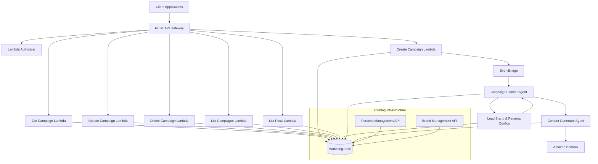

# Campaign Management API Design Document

## Overview

The Campaign Management API extends the existing Social Media Marketing Campaign Builder with comprehensive campaign orchestration capabilities. The system provides structured campaign creation, management, and execution while integrating seamlessly with the existing persona and brand management infrastructure. The API follows the established architectural patterns using AWS Lambda, DynamoDB, and EventBridge for scalable, event-driven campaign workflows.
The design emphasizes simplicity, tenant isolation, and integration with existing AI-powered content generation agents. The system supports multi-persona, multi-platform campaigns with sophisticated scheduling, cadence management, and status tracking throughout the campaign lifecycle.

## Architecture

### System Architecture

The Campaign Management API extends the existing infrastructure with additional Lambda functions and event-driven workflows:



### Integration Architecture

**Shared Infrastructure**
- **DynamoDB Table**: Reuses existing DynamoDB table (MarketingTable) for personas/brands/campaigns/posts using type-prefixed SKs and tenant-scoped PKs
- **API Gateway**: Extends existing CampaignApi with new campaign endpoints
- **Authorization**: Uses existing flexible authorizer configuration (internal or external)
- **EventBridge**: Leverages existing event bus for campaign workflow orchestration

**Event-Driven Workflows**
- **Campaign Creation**: Triggers campaign planning and content generation workflows
- **Status Updates**: Manages campaign lifecycle through event-driven state transitions
- **Content Generation**: Orchestrates multi-persona, multi-platform content creation
- **Error Handling**: Provides graceful failure recovery and status reporting

### Status Transition Rules

**Campaign Status Transitions:**
- `planning` → `generating`: When content generation begins
- `generating` → `completed`: When all posts reach `completed` or `skipped` status
- `generating` → `awaiting_review`: When generation finishes and ≥1 post has `needs_review` status
- `generating` → `failed`: When generation encounters unrecoverable errors
- `awaiting_review` → `completed`: When all `needs_review` posts are resolved (marked `completed` or `skipped`)
- `planning|generating|awaiting_review` → `cancelled`: When user cancels campaign

**Post Status Transitions:**
- `planned` → `generating`: When content generation starts for the post
- `generating` → `completed`: When content is successfully generated
- `generating` → `failed`: When content generation fails
- `planned` → `skipped`: When post is intentionally skipped due to constraints

### Update Permission Rules

**Planning Status**: All campaign fields editable
**Generating Status**:
- Editable: `name`, `brief.description`, `metadata`
- Not editable: `participants`, `schedule`, `cadenceOverrides`, `messaging` (anything affecting planned posts)
**Completed/Failed/Cancelled/Awaiting_Review Status**:
- Editable: `name`, `metadata` only
- For regeneration with new plan, use `POST /campaigns/{id}/regenerate` endpoint

### Brand Optionality

**Brand-less Mode** is intended for early MVP and personal use cases. When no brand is specified (`brandId: null`), the system uses these defaults:
- **Claims Policy**: No guarantees, require sources for stats, avoid competitor mentions
- **Platform Norms**: Standard cadence (3-5 posts/week), images encouraged, links allowed
- **Content Restrictions**: Generic compliance rules, no specific topic restrictions
- **Approval Policy**: Auto-approve mode with 0.7 threshold

## Components and Interfaces

### Core Components

#### 1. Campaign Management Service
- **Purpose**: Manages campaign CRUD operations and lifecycle
- **Responsibilities**: Campaign creation, updates, validation, status tracking
- **Interface**: REST API endpoints for campaign management
- **Dependencies**: DynamoDB, EventBridge, Persona/Brand APIs

#### 2. Campaign Orchestration Service
- **Purpose**: Coordinates campaign execution workflows
- **Responsibilities**: Content planning, generation scheduling, status management
- **Interface**: EventBridge event handlers and AI agent integration
- **Dependencies**: Campaign Planner Agent, Content Generator Agent

#### 3. Campaign Query Service
- **Purpose**: Provides campaign discovery and filtering capabilities
- **Responsibilities**: Campaign listing, search, filtering, pagination
- **Interface**: REST API with query parameters and filtering
- **Dependencies**: DynamoDB GSI patterns

### API Endpoints

The following endpoints extend the existing API Gateway:

```
POST   /campaigns                    # Create new campaign with comprehensive configuration
GET    /campaigns/{campaignId}       # Retrieve campaign details including all configuration
PUT    /campaigns/{campaignId}       # Update campaign information and configuration
DELETE /campaigns/{campaignId}       # Soft delete campaign
GET    /campaigns                    # List and search campaigns with filtering
GET    /campaigns/{campaignId}/posts # List campaign posts with platform/persona filtering
POST   /campaigns/{campaignId}/regenerate # Regenerate campaign with new plan
```

### Agent Integration

**Campaign Planner Agent**
- Analyzes campaign requirements and creates content plan
- Coordinates persona and platform distribution
- Generates scheduled post structure with topics and timing
- Integrates with existing persona style inference and brand guidelines

**Planner Input Merge Order:**
1. System defaults (when brandId is null)
2. Brand guidelines/policies/platform norms (when brand is specified)
3. Campaign overrides (cadence/messaging/asset requirements)
4. Per-persona constraints (voice traits and restrictions)

Campaign overrides can change topics and planning, but persona hard restrictions always win over campaign requirements to maintain authenticity.

**Content Generator Agent**
- Creates platform-specific content for each scheduled post
- Applies persona voice characteristics and brand compliance
- Generates visual asset requirements and descriptions
- Maintains content quality and consistency standards

### Planner Output Contract

A planned post must include:
- `personaId`, `platform`, `scheduledAt`
- `topic`, `intent`
- `assetRequirements`
- `references` (optional)

The `planVersion` is computed from a stable hash of campaign configuration and included in generation events to prevent stale writes.

## Data Models

### Campaign Entity

```javascript
{
  // DynamoDB Keys
  pk: `${tenantId}#${campaignId}`,
  sk: 'campaign',
  GSI1PK: `${tenantId}`,
  GSI1SK: `CAMPAIGN#${createdAt}`,
  GSI2PK: `${tenantId}`,
  GSI2SK: `CAMPAIGN#${status}#${createdAt}`,

  // Campaign Identity
  id: 'string',
  tenantId: 'string',
  brandId: 'string | null',
  name: 'string',

  // Campaign Brief
  brief: {
    description: 'string',
    objective: 'awareness | education | conversion | event | launch',
    primaryCTA: {
      type: 'string',
      text: 'string',
      url: 'string'
    } | null
  },

  // Participants Configuration
  participants: {
    personaIds: ['string'],
    platforms: ['twitter | linkedin | instagram | facebook'],
    distribution: {
      mode: 'balanced | weighted | custom',
      personaWeights: 'object | null',
      platformWeights: 'object | null'
    }
  },

  // Schedule Configuration
  schedule: {
    timezone: 'string',
    startDate: 'string',
    endDate: 'string',
    allowedDaysOfWeek: ['mon | tue | wed | thu | fri | sat | sun'],
    blackoutDates: ['string'] | null,
    postingWindows: [{
      start: 'string', // HH:MM format
      end: 'string'    // HH:MM format
    }] | null
  },

  // Cadence Overrides
  cadenceOverrides: {
    minPostsPerWeek: 'number | null',
    maxPostsPerWeek: 'number | null',
    maxPostsPerDay: 'number | null'
  } | null,

  // Messaging Strategy
  messaging: {
    pillars: [{
      name: 'string',
      weight: 'number'
    }] | null,
    requiredInclusions: ['string'] | null,
    campaignAvoidTopics: ['string'] | null
  } | null,

  // Asset Overrides
  assetOverrides: {
    forceVisuals: {
      twitter: 'boolean | null',
      linkedin: 'boolean | null',
      instagram: 'boolean | null',
      facebook: 'boolean | null'
    } | null
  } | null,

  // Campaign Status
  status: 'planning | generating | completed | failed | cancelled | awaiting_review',
  planSummary: {
    totalPosts: 'number',
    postsPerPlatform: 'object',
    postsPerPersona: 'object'
  } | null,

  // Error Tracking
  lastError: {
    code: 'string',
    message: 'string',
    at: 'string',
    retryable: 'boolean'
  } | null,

  // Metadata
  metadata: {
    source: 'wizard | api | import',
    externalRef: 'string | null'
  },
  createdAt: 'string',
  updatedAt: 'string',
  completedAt: 'string | null',
  version: 'number',
  planVersion: 'string | null' // Stable hash of {brief, participants, schedule, cadenceOverrides, messaging, assetOverrides}
}
```

### Social Post Entity

```javascript
{
  // DynamoDB Keys
  pk: `${tenantId}#${campaignId}`,
  sk: `POST#${postId}`,
  GSI1PK: `${tenantId}#${campaignId}`,
  GSI1SK: `POST#${platform}#${scheduledAt}`,
  GSI2PK: `${tenantId}#${personaId}`,
  GSI2SK: `POST#${campaignId}#${scheduledAt}`,

  // Post Identity
  postId: 'string',
  campaignId: 'string',
  tenantId: 'string',

  // Content Configuration
  personaId: 'string',
  platform: 'twitter | linkedin | instagram | facebook',
  scheduledAt: 'string', // ISO date-time in UTC
  topic: 'string',
  intent: 'announce | educate | opinion | invite_discussion | social_proof | reminder',

  // Asset Requirements
  assetRequirements: {
    imageRequired: 'boolean',
    imageDescription: 'string | null',
    videoRequired: 'boolean',
    videoDescription: 'string | null'
  } | null,

  // Generated Content
  content: {
    text: 'string',
    hashtags: ['string'] | null,
    mentions: ['string'] | null,
    generatedAt: 'string'
  } | null,

  // References
  references: [{
    type: 'url | assetId',
    value: 'string'
  }] | null,

  // Post Status
  status: 'planned | generating | completed | failed | skipped | needs_review',

  // Error Tracking
  lastError: {
    code: 'string',
    message: 'string',
    at: 'string',
    retryable: 'boolean'
  } | null,

  // Metadata
  createdAt: 'string',
  updatedAt: 'string',
  version: 'number'
}
```

### DynamoDB Access Patterns

**Campaign Operations**
```
# Create/Get/Update Campaign
PK: {tenantId}#{campaignId}
SK: 'campaign'

# List Campaigns by Tenant (chronological)
GSI1PK: {tenantId}
GSI1SK: 'CAMPAIGN#{createdAt}'

# Filter Campaigns by Status
GSI2PK: {tenantId}
GSI2SK: 'CAMPAIGN#{status}#{createdAt}'
```

**Post Operations**
```
# List Posts by Campaign
PK: {tenantId}#{campaignId}
SK: begins_with('POST#')

# List Posts by Platform within Campaign
GSI1PK: {tenantId}#{campaignId}
GSI1SK: 'POST#{platform}#{scheduledAt}'

# List Posts by Persona across Campaigns
GSI2PK: {tenantId}#{personaId}
GSI2SK: 'POST#{campaignId}#{scheduledAt}'
```
## Correctness Properties

*A property is a characteristic or behavior that should hold true across all valid executions of a system-essentially, a formal statement about what the system should do. Properties serve as the bridge between human-readable specifications and machine-verifiable correctness guarantees.*

After reviewing the prework analysis, several properties can be consolidated to eliminate redundancy:

**Property Reflection:**
- Properties 1.1, 1.5, 6.1 can be combined into a comprehensive "campaign creation completeness" property
- Properties 1.2, 1.3, 4.1, 5.1, 5.2 can be consolidated into a single "input validation consistency" property
- Properties 2.1, 3.1 can be merged into one "reference validation" property
- Properties 6.2, 6.3, 6.4, 6.5 can be combined into a "status transition consistency" property
- Properties 7.1, 7.2, 7.3, 7.4 can be consolidated into a "update permission enforcement" property
- Properties 8.1, 8.2, 8.3, 8.4 can be merged into a "query completeness and isolation" property

**Property 1: Campaign creation completeness**
*For any* valid campaign creation request, the system should capture all specified fields including name, brief, participants, schedule, messaging, and asset overrides, assign a unique ID, and set initial status to planning
**Validates: Requirements 1.1, 1.5, 6.1**

**Property 2: Input validation consistency**
*For any* campaign creation or update request, the system should validate objective types, CTA format, schedule configuration, cadence constraints, platform types, distribution weights, and messaging pillars according to specified rules
**Validates: Requirements 1.2, 1.3, 1.4, 4.1, 5.1, 5.2, 5.3, 11.1, 12.1**

**Property 3: Reference validation enforcement**
*For any* campaign with persona or brand references, the system should validate that all referenced entities exist, belong to the requesting tenant, and have compatible platform configurations
**Validates: Requirements 2.1, 3.1**

**Property 4: Referential integrity protection**
*For any* persona or brand deletion request, the system should prevent deletion if the entity is referenced by active campaigns
**Validates: Requirements 2.3, 3.3**

**Property 5: Brand configuration enforcement**
*For any* campaign with a brand ID, the system should validate brand compatibility with selected platforms and apply brand guidelines during content generation
**Validates: Requirements 3.1, 3.2**

**Property 6: Status transition consistency**
*For any* campaign status change, the system should update the status appropriately, maintain timestamp accuracy, and handle error conditions gracefully
**Validates: Requirements 6.2, 6.3, 6.4, 6.5**

**Property 7: Update permission enforcement**
*For any* campaign update request, the system should enforce update restrictions based on current campaign status while allowing appropriate modifications
**Validates: Requirements 7.1, 7.2, 7.3, 7.4**

**Property 8: Query completeness and isolation**
*For any* campaign or post query, the system should return complete data with proper filtering, ensure tenant isolation, and include all required associations
**Validates: Requirements 2.4, 4.4, 8.1, 8.2, 8.3, 8.4**

**Property 9: Event-driven workflow integration**
*For any* campaign lifecycle event, the system should publish appropriate events, handle workflow responses, and maintain data consistency
**Validates: Requirements 9.1, 9.2, 9.3, 9.4**

**Property 10: Messaging and asset configuration enforcement**
*For any* campaign with messaging pillars or asset overrides, the system should validate configuration completeness and enforce requirements during content generation
**Validates: Requirements 11.2, 11.3, 11.4, 12.2, 12.3**

**Property 11: Version and audit trail consistency**
*For any* campaign modification, the system should maintain version history, support historical queries, and handle soft deletion appropriately
**Validates: Requirements 10.1, 10.3, 10.4**
## Error Handling

### API Error Responses

**Validation Errors (400)**
```javascript
{
  statusCode: 400,
  body: JSON.stringify({
    message: 'Invalid campaign data',
    details: {
      field: 'objective',
      issue: 'Must be one of: awareness, education, conversion, event, launch'
    }
  })
}
```

**Authorization Errors (401/403)**
```javascript
{
  statusCode: 401,
  body: JSON.stringify({
    message: 'Unauthorized access'
  })
}
```

**Resource Not Found (404)**
```javascript
{
  statusCode: 404,
  body: JSON.stringify({
    message: 'Campaign not found',
    campaignId: 'campaign_123'
  })
}
```

**Conflict Errors (409)**
```javascript
{
  statusCode: 409,
  body: JSON.stringify({
    message: 'Cannot update campaign in generating status',
    currentStatus: 'generating'
  })
}
```

**Workflow Errors (422)**
```javascript
{
  statusCode: 422,
  body: JSON.stringify({
    message: 'Content generation failed',
    details: {
      reason: 'Insufficient persona examples for style inference',
      personaId: 'persona_456'
    }
  })
}
```

### Error Handling Strategy

- **Structured Responses**: Consistent error format across all endpoints
- **Contextual Logging**: Log errors with campaign, tenant, and operation context
- **Graceful Degradation**: Handle partial failures in multi-step workflows
- **Retry Logic**: Implement exponential backoff for transient AWS service failures
- **Circuit Breaker**: Protect against cascading failures in content generation workflows

## Testing Strategy

### Dual Testing Approach

The Campaign Management API requires both unit testing and property-based testing to ensure comprehensive coverage and correctness validation.

#### Unit Testing Requirements

Unit tests will verify specific examples, integration points, and error conditions:

- **API Endpoint Testing**: Verify each REST endpoint handles valid and invalid requests correctly
- **Data Validation**: Test Zod schema input validation for all campaign data structures
- **AWS Integration**: Test DynamoDB operations, EventBridge publishing, and error handling
- **Workflow Integration**: Test integration with existing persona and brand management APIs
- **Authentication**: Test JWT token processing and tenant isolation enforcement

#### Property-Based Testing Requirements

Property-based tests will verify universal properties across all valid inputs using **fast-check** as the testing library. Each property-based test will run a minimum of 100 iterations to ensure comprehensive coverage.

Property-based tests must be tagged with comments explicitly referencing the correctness property:
- Format: `**Feature: campaign-management-api, Property {number}: {property_text}**`
- Each correctness property will be implemented by a single property-based test
- Tests will generate random campaign data, persona/brand references, and workflow scenarios
- Generators will create realistic campaign definitions within valid constraints

#### Integration Testing

- **Event-Driven Workflows**: Test complete campaign creation to content generation workflows
- **Cross-Service Integration**: Verify integration with persona and brand management APIs
- **Agent Coordination**: Test campaign planner and content generator agent interactions
- **Error Recovery**: Validate error handling and recovery mechanisms across workflows

### Testing Infrastructure

- **Test Data Generation**: Create realistic campaign data generators for consistent testing
- **Mock Services**: Mock external dependencies (Bedrock, EventBridge) for isolated unit testing
- **Event Simulation**: Simulate EventBridge events for workflow testing
- **Performance Testing**: Validate API response times and throughput under load

## Performance Considerations

### DynamoDB Optimization

#### Key Design Patterns
- **Composite Keys**: Use `tenantId#campaignId` for efficient tenant isolation and campaign access
- **GSI Patterns**: Implement GSI1 for tenant-scoped queries and campaign filtering
- **Hot Partition Avoidance**: Distribute writes using timestamps and status prefixes

#### Query Optimization
- **Projection Expressions**: Limit returned data to required fields for list operations
- **Pagination**: Implement efficient pagination using DynamoDB's LastEvaluatedKey
- **Batch Operations**: Use BatchGetItem for retrieving multiple campaigns or posts

### Event-Driven Performance

#### EventBridge Optimization
- **Event Batching**: Batch related events to reduce EventBridge costs
- **Event Filtering**: Use event patterns to minimize unnecessary Lambda invocations
- **Dead Letter Queues**: Implement DLQs for failed event processing

#### Workflow Optimization
- **Parallel Processing**: Execute content generation for multiple personas in parallel
- **Checkpoint Management**: Implement checkpoints for long-running campaign generation
- **Resource Allocation**: Optimize Lambda memory and timeout settings for different workflow stages

### Memory and Timeout Configuration

```yaml
Globals:
  Function:
    Runtime: nodejs24.x
    Timeout: 25
    MemorySize: 1024
    Environment:
      Variables:
        AWS_NODEJS_CONNECTION_REUSE_ENABLED: 1

# Specialized configurations for workflow functions
CampaignPlannerFunction:
  Timeout: 300
  MemorySize: 2048

ContentGeneratorFunction:
  Timeout: 120
  MemorySize: 2048
```

## Security Considerations

### Data Protection

#### Encryption and Access Control
- **Data at Rest**: All DynamoDB tables encrypted with AWS managed keys
- **Data in Transit**: HTTPS/TLS for all API communications
- **IAM Policies**: Least privilege access for Lambda execution roles
- **API Gateway Authorization**: JWT token validation with tenant context

### Tenant Isolation

#### Data Segregation
- **Partition Key Isolation**: Tenant ID embedded in all DynamoDB partition keys
- **Query Filtering**: All queries automatically filtered by tenant context
- **Event Isolation**: EventBridge events include tenant context for proper routing

#### Audit and Compliance
- **Access Logging**: Comprehensive logging of all campaign operations
- **Change Tracking**: Audit trails for all campaign modifications
- **Compliance Validation**: Automated checking against data privacy regulations

### Input Validation and Sanitization

#### Data Validation
- **Schema Validation**: Zod schemas for all input data structures
- **Reference Validation**: Strict validation of persona and brand references
- **Business Rule Validation**: Enforce campaign constraints and business logic
- **Content Scanning**: Validate generated content for compliance and safety

## Deployment and Operations

### Infrastructure as Code

The Campaign Management API will be deployed using AWS SAM templates that extend the existing infrastructure:

```yaml
# Key additions to existing template
Resources:
  UpdateCampaignFunction:
    Type: AWS::Serverless::Function
    Properties:
      Handler: campaign/update-campaign.handler
      Policies:
        - DynamoDBCrudPolicy:
            TableName: !Ref MarketingTable
        - EventBridgePublishPolicy:
            EventBusName: default

  DeleteCampaignFunction:
    Type: AWS::Serverless::Function
    Properties:
      Handler: campaign/delete-campaign.handler
      Policies:
        - DynamoDBCrudPolicy:
            TableName: !Ref MarketingTable

  ListCampaignsFunction:
    Type: AWS::Serverless::Function
    Properties:
      Handler: campaign/list-campaigns.handler
      Policies:
        - DynamoDBReadPolicy:
            TableName: !Ref MarketingTable
```

### Monitoring and Alerting

#### CloudWatch Metrics
- **API Performance**: Response times, error rates, and throughput metrics
- **Campaign Metrics**: Creation rates, completion rates, and failure analysis
- **Workflow Metrics**: Content generation success rates and processing times
- **DynamoDB Metrics**: Read/write capacity utilization and throttling

#### Alerting Thresholds
- **Error Rate**: Alert when campaign API error rate exceeds 5%
- **Latency**: Alert when P95 response time exceeds 2 seconds
- **Workflow Failures**: Alert when content generation failure rate exceeds 10%
- **Capacity**: Alert when DynamoDB utilization exceeds 80%

### Backup and Recovery

#### Data Backup
- **DynamoDB Backups**: Automated daily backups with point-in-time recovery
- **Event Replay**: Capability to replay EventBridge events for workflow recovery
- **Cross-Region Replication**: Replicate critical campaign data to secondary region

#### Disaster Recovery
- **RTO Target**: 4 hours for full service restoration
- **RPO Target**: 1 hour maximum data loss
- **Failover Procedures**: Automated failover to secondary region
- **Data Consistency**: Ensure campaign data consistency across regions
