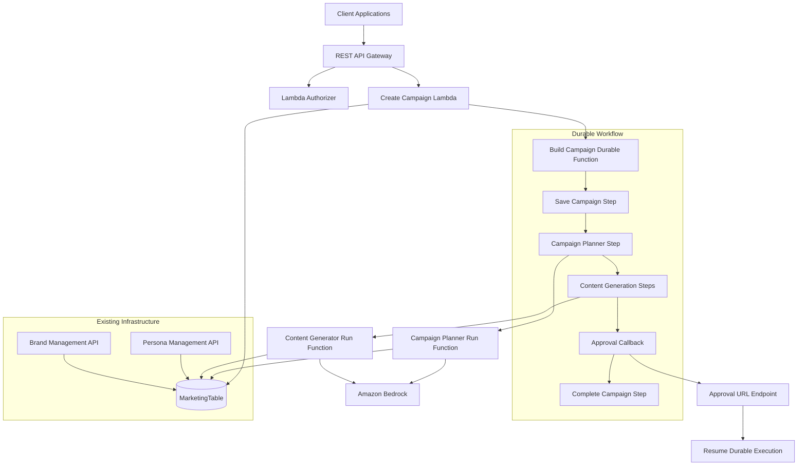
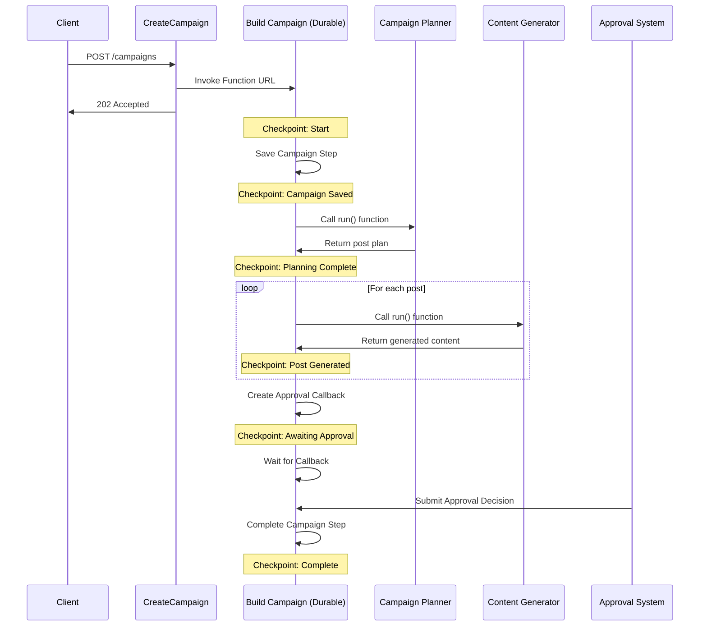

# Campaign Orchestration with Durable Functions Design Document

## Overview

The Campaign Orchestration with Durable Functions system transforms the existing event-driven campaign workflow into a resilient, long-running orchestration using AWSble Functions. This design leverages Lambda's checkpoint-and-replay mechanism to create fault-tolerant, multi-step campaign building workflows that can execute for extended periods, handle human-in-the-loop approvals, and recover from failures while maintaining state consistency.

The system replaces EventBridge-based asynchronous workflows with direct function invocations within a durable execution context, providing better error handling, state management, and operational visibility. The design emphasizes simplicity, reliability, and integration with existing campaign management infrastructure while introducing new capabilities for long-running orchestration processes.

## Architecture

### System Architecture

The durable function orchestration extends the existing campaign management infrastructure with resilient workflow capabilities:



### Durable Function Workflow

The Build Campaign durable function orchestrates the complete campaign creation process:



### Direct Lambda Invocation

The Build Campaign function is invoked directly using the Lambda InvokeFunction API:

```yaml
BuildCampaignFunction:
  Type: AWS::Serverless::Function
  Properties:
    DurableConfig:
      ExecutionTimeout: PT1H  # 1 hour
      RetentionPeriod: P30D   # 30 days
```

### Agent Integration Pattern

Agents are refactored to export `run` functions for direct invocation:

```javascript
// Campaign Planner Agent
export const run = async (tenantId, campaignData) => {
  // Agent execution logic
  return planResults;
};

// Content Generator Agent
export const run = async (tenantId, postData) => {
  // Agent execution logic
  return generatedContent;
};
```

## Components and Interfaces

### Core Components

#### 1. Build Campaign Durable Function
- **Purpose**: Orchestrates the complete campaign building workflow
- **Responsibilities**: State management, checkpoint creation, agent coordination, approval handling
- **Interface**: Function URL endpoint with IAM authentication
- **Dependencies**: Campaign Planner Agent, Content Generator Agent, DynamoDB

#### 2. Campaign Planner Agent (Enhanced)
- **Purpose**: Creates comprehensive campaign plans and post schedules
- **Responsibilities**: Brand/persona configuration loading, post planning, topic generation
- **Interface**: Exported `run` function for direct invocation
- **Dependencies**: DynamoDB, Amazon Bedrock

#### 3. Content Generator Agent (Enhanced)
- **Purpose**: Generates platform-specific content for individual posts
- **Responsibilities**: Content creation, persona voice matching, brand compliance
- **Interface**: Exported `run` function for direct invocation
- **Dependencies**: DynamoDB, Amazon Bedrock

#### 4. Approval Callback Handler
- **Purpose**: Handles campaign approval decisions and resumes durable execution
- **Responsibilities**: Callback validation, execution resumption, security enforcement
- **Interface**: REST API endpoint for approval submissions
- **Dependencies**: Lambda Durable Execution API

### Durable Function Operations

The Build Campaign function uses the following durable operations:

#### Steps
```javascript
// Save campaign data with retry logic
const campaignSaved = await context.step('Save campaign', async () => {
  return await saveCampaignToDynamoDB(tenantId, campaign);
});

// Generate campaign plan
const planResults = await context.step('Generate plan', async () => {
  return await campaignPlannerRun(tenantId, campaignData);
});

// Generate content for each post
const contentResults = await context.map('Generate content', posts, async (post) => {
  return await contentGeneratorRun(tenantId, post);
}, { maxConcurrency: 5 });
```

#### Callbacks
```javascript
// Create approval callback
const { callbackId, promise } = await context.createCallback('Campaign approval', {
  timeoutMs: 7 * 24 * 60 * 60 * 1000, // 7 days
  heartbeatTimeoutMs: 24 * 60 * 60 * 1000 // 24 hours
});

// Generate approval URL
const approvalUrl = generateApprovalUrl(callbackId, tenantId, campaignId);

// Wait for approval decision
const approvalDecision = await promise;
```

#### Parallel Processing
```javascript
// Process posts in parallel with concurrency control
const results = await context.parallel('Process posts', [
  () => context.map('Generate content batch 1', batch1, generateContent),
  () => context.map('Generate content batch 2', batch2, generateContent),
  () => context.map('Generate content batch 3', batch3, generateContent)
], {
  completionPolicy: 'all',
  maxConcurrency: 3
});
```

### API Interfaces

#### Build Campaign Direct Invocation
```javascript
// From Create Campaign Lambda
const lambdaClient = new LambdaClient();
await lambdaClient.send(new InvokeCommand({
  FunctionName: process.env.BUILD_CAMPAIGN_FUNCTION_NAME,
  InvocationType: 'Event', // Asynchronous invocation
  Payload: JSON.stringify({
    tenantId,
    campaign: campaignData
  })
}));
```

#### Approval Callback Endpoint
```
POST /campaigns/{campaignId}/approve
Authorization: Bearer {approval-token}
Content-Type: application/json

{
  "decision": "approved" | "rejected" | "needs_revision",
  "comments": "string",
  "callbackId": "string"
}
```

## Data Models

### Durable Execution Context

The durable function maintains execution state through checkpoints:

```javascript
{
  executionId: 'string',
  tenantId: 'string',
  campaignId: 'string',

  // Execution metadata
  startedAt: 'string',
  lastCheckpointAt: 'string',
  status: 'running' | 'waiting_callback' | 'completed' | 'failed',

  // Workflow state
  currentStep: 'string',
  completedSteps: ['string'],
  checkpoints: [{
    stepName: 'string',
    timestamp: 'string',
    result: 'any',
    error: 'object | null'
  }],

  // Callback state
  activeCallbacks: [{
    callbackId: 'string',
    type: 'approval',
    createdAt: 'string',
    timeoutAt: 'string',
    metadata: 'object'
  }]
}
```

### Agent Input/Output Contracts

#### Campaign Planner Input
```javascript
{
  tenantId: 'string',
  campaignId: 'string',
  campaign: {
    // Complete campaign configuration
  },
  brandConfig: 'object | null',
  personaConfigs: ['object'],
  mergedConfig: 'object'
}
```

#### Campaign Planner Output
```javascript
{
  success: 'boolean',
  planSummary: {
    totalPosts: 'number',
    postsPerPlatform: 'object',
    postsPerPersona: 'object'
  },
  posts: [{
    postId: 'string',
    personaId: 'string',
    platform: 'string',
    scheduledAt: 'string',
    topic: 'string',
    intent: 'string',
    assetRequirements: 'object'
  }],
  error: 'string | null'
}
```

#### Content Generator Input
```javascript
{
  tenantId: 'string',
  campaignId: 'string',
  postId: 'string',
  post: {
    // Complete post configuration
  },
  personaConfig: 'object',
  brandConfig: 'object | null'
}
```

#### Content Generator Output
```javascript
{
  success: 'boolean',
  content: {
    text: 'string',
    hashtags: ['string'],
    mentions: ['string'],
    generatedAt: 'string'
  },
  error: 'string | null'
}
```

### Approval Callback Data

```javascript
{
  callbackId: 'string',
  tenantId: 'string',
  campaignId: 'string',
  executionId: 'string',

  // Security
  token: 'string', // JWT token for approval URL
  expiresAt: 'string',

  // Approval context
  approvalUrl: 'string',
  campaignSummary: {
    name: 'string',
    totalPosts: 'number',
    platforms: ['string'],
    personas: ['string']
  },

  // Callback metadata
  createdAt: 'string',
  timeoutAt: 'string',
  heartbeatAt: 'string | null'
}
```

## Correctness Properties

*A property is a characteristic or behavior that should hold true across all valid executions of a system-essentially, a formal statement about what the system should do. Properties serve as the bridge between human-readable specifications and machine-verifiable correctness guarantees.*

Let me analyze the acceptance criteria for testability using the prework tool:


After completing the prework analysis, I can identify several properties that can be consolidated to eliminate redundancy:

**Property Reflection:**
- Properties 1.1, 1.4 can be combined into "workflow initiation and completion consistency"
- Properties 1.2, 1.3, 7.1, 7.4 can be consolidated into "checkpoint and recovery consistency"
- Properties 3.1, 3.2, 4.1, 6.2 can be merged into "agent integration consistency"
- Properties 3.3, 4.2, 4.3 can be cnto "workflow progression and status consistency"
- Properties 3.4, 4.4, 6.5 can be consolidated into "retry and error handling consistency"
- Properties 5.1, 5.2, 5.3 can be merged into "callback workflow consistency"
- Properties 8.1, 8.2, 8.3 can be combined into "parallel processing consistency"
- Properties 9.1, 9.2, 9.3 can be consolidated into "security and tenant isolation consistency"

**Property 1: Workflow initiation and completion consistency**
*For any* campaign creation request, the system should invoke the durable function asynchronously, return immediately with status, and update final campaign status to reflect workflow completion state
**Validates: Requirements 1.1, 1.4**

**Property 2: Checkpoint and recovery consistency**
*For any* durable function execution, the system should create detailed checkpoints for each workflow step and resume from the last successful checkpoint during interruptions without losing progress
**Validates: Requirements 1.2, 1.3, 7.1, 7.4**

**Property 3: Direct invocation security and validation**
*For any* direct Lambda invocation, the system should validate IAM permissions, validate tenant context and campaign data from event payload, and handle asynchronous execution properly
**Validates: Requirements 2.2, 2.3, 2.4**

**Property 4: Agent integration consistency**
*For any* agent invocation within the durable workflow, the system should call agent run functions directly with complete configuration data and receive structured results for workflow continuation
**Validates: Requirements 3.1, 3.2, 4.1, 6.2, 6.4**

**Property 5: Workflow progression and status consistency**
*For any* workflow step completion, the system should checkpoint results, update appropriate status values, and proceed to the next workflow step
**Validates: Requirements 3.3, 4.2, 4.3**

**Property 6: Retry and error handling consistency**
*For any* workflow step failure, the system should retry according to configured policies, return structured error information, and update status appropriately
**Validates: Requirements 1.5, 3.4, 4.4, 6.3, 6.5**

**Property 7: Input validation consistency**
*For any* agent run function input, the system should validate parameters and return structured error responses for invalid inputs
**Validates: Requirements 3.5, 6.3**

**Property 8: Callback workflow consistency**
*For any* approval workflow, the system should create callbacks with unique URLs, suspend execution, and resume with approval decisions when callbacks are submitted
**Validates: Requirements 5.1, 5.2, 5.3, 5.4, 5.5**

**Property 9: Callback timeout handling**
*For any* approval callback, the system should handle timeouts according to configured policies when approval decisions are not received within timeout periods
**Validates: Requirements 5.6**

**Property 10: Parallel processing consistency**
*For any* content generation workflow, the system should process posts in parallel within concurrency limits, maintain separate checkpoints, and aggregate results while handling partial failures
**Validates: Requirements 8.1, 8.2, 8.3, 8.4, 8.5**

**Property 11: Workflow state and monitoring consistency**
*For any* workflow execution, the system should provide current execution status, emit CloudWatch metrics, log structured events with correlation IDs, and provide operational visibility
**Validates: Requirements 7.2, 7.3, 7.5, 10.1, 10.2, 10.5**

**Property 12: Security and tenant isolation consistency**
*For any* durable function operation, the system should validate tenant context, pass tenant information securely, include security tokens in callback URLs, and prevent cross-tenant access
**Validates: Requirements 9.1, 9.2, 9.3, 9.4, 9.5**

**Property 13: Performance and alerting consistency**
*For any* workflow error or performance threshold violation, the system should generate alerts with troubleshooting context and trigger automated scaling or throttling responses
**Validates: Requirements 10.3, 10.4**

## Error Handling

### Durable Function Error Handling

The durable function implements comprehensive error handling with automatic retry and recovery:

#### Step-Level Error Handling
```javascript
const result = await context.step('Campaign planning', async () => {
  try {
    return await campaignPlannerRun(tenantId, campaignData);
  } catch (error) {
    if (error.code === 'INSUFFICIENT_EXAMPLES') {
      throw new RetryableError('Persona needs more examples', error);
    }
    if (error.code === 'BRAND_NOT_FOUND') {
      throw new NonRetryableError('Brand configuration missing', error);
    }
    throw error; // Unknown errors are retryable by default
  }
}, {
  retryPolicy: {
    maxAttempts: 3,
    backoffCoefficient: 2.0,
    initialInterval: 1000,
    maximumInterval: 30000
  }
});
```

#### Workflow-Level Error Handling
```javascript
export const handler = withDurableExecution(async (event, context) => {
  try {
    // Workflow steps
    return await executeWorkflow(context, event);
  } catch (error) {
    // Log error with context
    console.error('Workflow failed', {
      executionId: context.executionId,
      tenantId: event.tenantId,
      campaignId: event.campaignId,
      error: error.message,
      stack: error.stack
    });

    // Update campaign status
    await updateCampaignStatus(event.tenantId, event.campaignId, 'failed', {
      error: {
        code: error.code || 'WORKFLOW_ERROR',
        message: error.message,
        at: new Date().toISOString(),
        retryable: error.retryable !== false
      }
    });

    throw error;
  }
});
```

### Agent Error Handling

Agents return structured error responses for proper workflow handling:

```javascript
export const run = async (tenantId, input) => {
  try {
    // Validate input
    const validatedInput = inputSchema.parse(input);

    // Execute agent logic
    const result = await executeAgentLogic(tenantId, validatedInput);

    return {
      success: true,
      result,
      error: null
    };
  } catch (error) {
    return {
      success: false,
      result: null,
      error: {
        code: error.code || 'AGENT_ERROR',
        message: error.message,
        retryable: error.retryable !== false,
        details: error.details || null
      }
    };
  }
};
```

### Callback Error Handling

Approval callbacks include comprehensive error handling and security validation:

```javascript
export const handleApprovalCallback = async (event) => {
  try {
    // Validate callback token
    const { callbackId, tenantId, campaignId } = validateCallbackToken(event.headers.authorization);

    // Validate callback exists and is active
    const callback = await getActiveCallback(callbackId);
    if (!callback) {
      return formatResponse(404, { message: 'Callback not found or expired' });
    }

    // Submit callback result
    await submitCallbackResult(callbackId, event.body);

    return formatResponse(200, { message: 'Approval submitted successfully' });
  } catch (error) {
    console.error('Callback submission failed', {
      callbackId: event.pathParameters?.callbackId,
      error: error.message
    });

    if (error.code === 'INVALID_TOKEN') {
      return formatResponse(401, { message: 'Invalid or expired approval token' });
    }

    return formatResponse(500, { message: 'Failed to process approval' });
  }
};
```

## Testing Strategy

### Dual Testing Approach

The Campaign Orchestration with Durable Functions system requires both unit testing and property-based testing to ensure comprehensive coverage and correctness validation.

#### Unit Testing Requirements

Unit tests will verify specific examples, integration points, and error conditions:

- **Durable Function Testing**: Test individual workflow steps, checkpoint creation, and recovery scenarios
- **Agent Integration**: Test direct invocation of agent run functions with various input scenarios
- **Direct Invocation Security**: Test IAM permissions, event validation, and asynchronous execution
- **Callback Handling**: Test approval callback creation, submission, and timeout scenarios
- **Error Recovery**: Test specific error conditions and retry behavior

#### Property-Based Testing Requirements

Property-based tests will verify universal properties across all valid inputs using **fast-check** as the testing library. Each property-based test will run a minimum of 100 iterations to ensure comprehensive coverage.

Property-based tests must be tagged with comments explicitly referencing the correctness property:
- Format: `**Feature: campaign-orchestration-durable, Property {number}: {property_text}**`
- Each correctness property will be implemented by a single property-based test
- Tests will generate random campaign data, workflow scenarios, and failure conditions
- Generators will create realistic durable function execution scenarios within valid constraints

#### Durable Function Testing

The system will use the Lambda Durable Functions Testing SDK for comprehensive workflow testing:

```javascript
import { DurableTestingClient } from '@aws/durable-execution-testing-sdk-js';

const testClient = new DurableTestingClient({
  store: 'memory' // or 'filesystem' for persistent testing
});

// Test workflow execution
const execution = await testClient.startExecution({
  functionName: 'BuildCampaignFunction',
  input: { tenantId: 'test-tenant', campaign: testCampaign }
});

// Verify checkpoints and state
const history = await execution.getHistory();
expect(history.checkpoints).toContainEqual({
  stepName: 'Save campaign',
  status: 'completed'
});
```

#### Integration Testing

- **End-to-End Workflows**: Test complete campaign creation through approval workflows
- **Agent Coordination**: Verify proper integration between durable functions and agent run functions
- **Callback Workflows**: Test approval URL generation, submission, and execution resumption
- **Parallel Processing**: Validate concurrent content generation with proper checkpoint management
- **Error Recovery**: Test workflow recovery from various failure scenarios

### Testing Infrastructure

- **Mock Services**: Mock external dependencies (DynamoDB, Bedrock) for isolated testing
- **Workflow Simulation**: Simulate long-running workflows and interruption scenarios
- **Security Testing**: Validate Function URL authentication and callback security
- **Performance Testing**: Test parallel processing limits and concurrency control

## Performance Considerations

### Durable Function Optimization

#### Execution Efficiency
- **Checkpoint Granularity**: Balance checkpoint frequency with performance overhead
- **State Management**: Minimize checkpoint payload size to reduce storage costs
- **Parallel Processing**: Optimize concurrency limits based on downstream service capacity
- **Memory Configuration**: Right-size Lambda memory for workflow complexity

#### Cost Optimization
```yaml
BuildCampaignFunction:
  MemorySize: 2048  # Higher memory for complex workflows
  Timeout: 3600     # 1 hour for complete campaign building
  DurableConfig:
    ExecutionTimeout: PT1H    # Match function timeout
    RetentionPeriod: P30D     # 30 days for audit requirements
```

### Agent Performance

#### Direct Invocation Benefits
- **Reduced Latency**: Eliminate EventBridge processing overhead
- **Synchronous Execution**: Immediate error handling and result processing
- **Resource Efficiency**: No event queuing or delivery delays
- **Simplified Debugging**: Direct function call stack traces

#### Memory and Timeout Optimization
```yaml
CampaignPlannerFunction:
  MemorySize: 3008  # Maximum memory for complex planning
  Timeout: 300      # 5 minutes for planning operations

ContentGeneratorFunction:
  MemorySize: 2048  # Optimized for content generation
  Timeout: 120      # 2 minutes per post generation
```

### Parallel Processing Optimization

#### Concurrency Management
```javascript
// Optimize concurrency based on downstream capacity
const contentResults = await context.map('Generate content', posts,
  async (post) => await generateContent(post),
  {
    maxConcurrency: Math.min(posts.length, 10), // Limit concurrent operations
    completionPolicy: 'all' // Wait for all posts to complete
  }
);
```

#### Batch Processing
```javascript
// Process posts in batches to manage memory and performance
const batches = chunkArray(posts, 20); // 20 posts per batch
const batchResults = await context.map('Process batches', batches,
  async (batch) => await processBatch(batch),
  { maxConcurrency: 3 } // 3 concurrent batches
);
```

## Security Considerations

### Direct Invocation Security

#### IAM Execution Roles
```yaml
CreateCampaignFunction:
  Policies:
    - Statement:
        Effect: Allow
        Action:
          - lambda:InvokeFunction
        Resource: !GetAtt BuildCampaignFunction.Arn
```

#### Event Validation
```javascript
export const handler = withDurableExecution(async (event, context) => {
  // Validate event structure
  const { tenantId, campaign } = validateInvocationEvent(event);

  // Validate campaign data schema
  const validatedCampaign = validateCampaignInput(campaign);

  // Execute workflow with validated context
  return await executeWorkflow(context, { tenantId, campaign: validatedCampaign });
});
```

### Callback Security

#### Token-Based Authentication
```javascript
const generateApprovalToken = (callbackId, tenantId, campaignId) => {
  return jwt.sign(
    {
      callbackId,
      tenantId,
      campaignId,
      type: 'approval',
      exp: Math.floor(Date.now() / 1000) + (7 * 24 * 60 * 60) // 7 days
    },
    process.env.CALLBACK_SECRET,
    { algorithm: 'HS256' }
  );
};
```

#### URL Security
```javascript
const generateSecureApprovalUrl = (callbackId, tenantId, campaignId) => {
  const token = generateApprovalToken(callbackId, tenantId, campaignId);
  const nonce = crypto.randomBytes(16).toString('hex');

  return `${process.env.APPROVAL_BASE_URL}/approve/${callbackId}?token=${token}&nonce=${nonce}`;
};
```

### Data Protection

#### Tenant Isolation
- **Execution Context**: Validate tenant context in all durable function operations
- **Agent Calls**: Pass tenant information securely to all agent invocations
- **Data Access**: Ensure all DynamoDB operations include tenant-scoped keys
- **Callback Validation**: Verify tenant ownership of callback operations

#### Encryption and Audit
- **Checkpoint Encryption**: Durable function checkpoints encrypted at rest
- **Audit Logging**: Comprehensive audit trails for all workflow operations
- **Sensitive Data**: Encrypt sensitive campaign data in checkpoints
- **Access Logging**: Log all Function URL and callback access attempts

## Deployment and Operations

### Infrastructure as Code

The durable function orchestration will be deployed using AWS SAM templates:

```yaml
Resources:
  CreateCampaignFunction:
    Type: AWS::Serverless::Function
    Properties:
      Handler: campaign/create-campaign.handler
      Policies:
        - DynamoDBCrudPolicy:
            TableName: !Ref MarketingTable
        - Statement:
            Effect: Allow
            Action:
              - lambda:InvokeFunction
            Resource: !GetAtt BuildCampaignFunction.Arn

  BuildCampaignFunction:
    Type: AWS::Serverless::Function
    Properties:
      Handler: campaign/build-campaign.handler
      Runtime: nodejs24.x
      MemorySize: 2048
      Timeout: 3600
      DurableConfig:
        ExecutionTimeout: PT1H
        RetentionPeriod: P30D

      Policies:
        - DynamoDBCrudPolicy:
            TableName: !Ref MarketingTable
        - Statement:
            Effect: Allow
            Action:
              - lambda:InvokeFunction
            Resource:
              - !GetAtt CampaignPlannerFunction.Arn
              - !GetAtt ContentGeneratorFunction.Arn

  ApprovalCallbackFunction:
    Type: AWS::Serverless::Function
    Properties:
      Handler: campaign/approval-callback.handler
      Events:
        ApprovalApi:
          Type: Api
          Properties:
            Path: /campaigns/{campaignId}/approve
            Method: POST
      Policies:
        - Statement:
            Effect: Allow
            Action:
              - lambda:SendDurableExecutionCallbackSuccess
              - lambda:SendDurableExecutionCallbackFailure
            Resource: "*"
```

### Monitoring and Alerting

#### CloudWatch Metrics
- **Execution Metrics**: Duration, success rate, checkpoint count per execution
- **Workflow Metrics**: Step completion rates, retry counts, failure analysis
- **Callback Metrics**: Approval rates, timeout rates, response times
- **Performance Metrics**: Parallel processing efficiency, concurrency utilization

#### Custom Dashboards
```javascript
// Emit custom metrics from durable function
await cloudWatch.putMetricData({
  Namespace: 'CampaignOrchestration',
  MetricData: [{
    MetricName: 'WorkflowStepDuration',
    Value: stepDuration,
    Unit: 'Milliseconds',
    Dimensions: [{
      Name: 'StepName',
      Value: stepName
    }, {
      Name: 'TenantId',
      Value: tenantId
    }]
  }]
});
```

#### Alerting Thresholds
- **Execution Failures**: Alert when durable function failure rate exceeds 5%
- **Callback Timeouts**: Alert when approval timeout rate exceeds 20%
- **Performance Degradation**: Alert when average execution time exceeds baseline by 50%
- **Security Events**: Alert on authentication failures or unauthorized access attempts

### Operational Procedures

#### Workflow Monitoring
- **Execution Tracking**: Monitor active executions and their current steps
- **Checkpoint Analysis**: Analyze checkpoint patterns for optimization opportunities
- **Error Investigation**: Use execution history for debugging failed workflows
- **Performance Tuning**: Adjust concurrency limits and memory allocation based on metrics

#### Incident Response
- **Execution Recovery**: Procedures for recovering stuck or failed executions
- **Callback Management**: Handle expired or invalid approval callbacks
- **Data Consistency**: Verify campaign data consistency after workflow failures
- **Rollback Procedures**: Rollback mechanisms for partially completed campaigns

