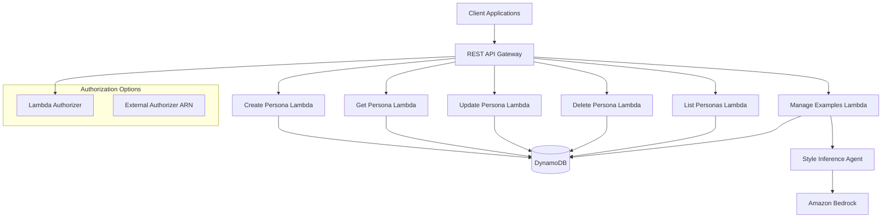

# Design Document

## Overview

The Persona Management API is a serverless REST API built on AWS Lambda that provides comprehensive persona creation, management, and style inference capabilities. The system leverages native JavaScript ES6+ modules with .mjs extension for AI-powered style analysis and DynamoDB for scalable data storage with tenant isolation.

## Architecture

### High-Level Architecture



### Component Architecture

**API Gateway Layer**
- REST API Gateway for structured endpoint management
- Flexible authorization configuration supporting both internal and external authorizers
- Request/response transformation and validation
- CORS configuration for web client access

**Authorization Configuration**
- Optional external authorizer ARN parameter for integration with existing auth systems
- Internal Lambda authorizer as fallback when external ARN not provided
- Consistent tenant context extraction regardless of authorizer source
- JWT token validation with configurable authorization logic

**Lambda Functions**
- One Lambda function per endpoint for focused functionality using .mjs modules
- Native JavaScript agent integration for style inference in examples endpoint
- Connection pooling for DynamoDB and Bedrock using AWS SDK v3
- Structured error handling and logging per function

**Data Layer**
- DynamoDB single table design with tenant isolation
- S3 bucket for storing writing sample files
- Efficient query patterns for persona retrieval
- Version control through item timestamps

### Deployment Configuration

**Authorizer Configuration**
The system supports flexible authorization through an optional deployment parameter:

- **AuthorizerArn Parameter**: Optional CloudFormation parameter accepting an existing Lambda authorizer ARN
- **Conditional Authorization**: When AuthorizerArn is provided, the API Gateway uses the external authorizer
- **Internal Authorizer Fallback**: When AuthorizerArn is not provided, the system deploys and uses its own Lambda authorizer
- **Consistent Context**: Both authorization approaches must provide tenant context in the same format

**Parameter Structure**
```yaml
Parameters:
  AuthorizerArn:
    Type: String
    Default: ""
    Description: Optional ARN of existing Lambda authorizer. If not provided, internal authorizer will be created.
```

**Authorization Requirements**
Regardless of the authorizer source, the authorization response must include:
- Principal ID representing the authenticated user or system
- Policy document allowing API Gateway execution
- Context object containing `tenantId` for multi-tenant data isolation

**SAM Template Implementation**
The CloudFormation template uses conditional logic to handle authorizer configuration:

```yaml
Conditions:
  CreateInternalAuthorizer: !Equals [!Ref AuthorizerArn, ""]

Resources:
  # Internal authorizer - only created when external ARN not provided
  AuthorizerFunction:
    Type: AWS::Serverless::Function
    Condition: CreateInternalAuthorizer
    Properties:
      Handler: auth/authorizer.handler
      # ... function configuration

  # API Gateway with conditional authorizer reference
  CampaignApi:
    Type: AWS::Serverless::Api
    Properties:
      Auth:
        DefaultAuthorizer: !If
          - CreateInternalAuthorizer
          - InternalAuthorizer
          - ExternalAuthorizer
        Authorizers:
          InternalAuthorizer:
            FunctionArn: !If
              - CreateInternalAuthorizer
              - !GetAtt AuthorizerFunction.Arn
              - !Ref AWS::NoValue
          ExternalAuthorizer:
            FunctionArn: !If
              - CreateInternalAuthorizer
              - !Ref AWS::NoValue
              - !Ref AuthorizerArn
```

## Components and Interfaces

### REST API Endpoints

**Persona CRUD Operations**
```
POST   /personas                    # Create new persona
GET    /personas/{personaId}        # Get persona by ID (includes inferred style)
PUT    /personas/{personaId}        # Update persona
DELETE /personas/{personaId}        # Soft delete persona
GET    /personas                    # List/search personas
```

**Writing Examples Management**
```
POST   /personas/{personaId}/examples    # Add writing examples (triggers style inference)
GET    /personas/{personaId}/examples    # Get writing examples
DELETE /personas/{personaId}/examples/{exampleId}  # Delete specific example
```

**Authorization Integration**
```
Authorization Context Flow:
1. Client sends request with Bearer token
2. API Gateway invokes authorizer (internal or external)
3. Authorizer validates token and returns policy with tenant context
4. API Gateway forwards request to Lambda with tenant information
5. Lambda functions use tenant context for data isolation
```

### Agent Integration

**Style Inference Agent**
- Specialized agent using native JavaScript modules for writing analysis
- Integration with Amazon Bedrock Converse API for natural language processing
- Configurable analysis parameters for different style aspects using Zod schemas
- Structured output format for consistent style data
## Data Models

### Persona Entity

```javascript
// Persona data structure (validated with Zod schemas)
const personaSchema = {
  // Identity
  personaId: 'string',
  tenantId: 'string',
  name: 'string',
  role: 'string',
  company: 'string',
  primaryAudience: 'executives | professionals | consumers | technical | creative',

  // Voice Traits (array of descriptive traits)
  voiceTraits: ['string'], // e.g., ['direct', 'warm', 'opinionated']

  // Writing Habits
  writingHabits: {
    paragraphs: 'short | medium | long',
    questions: 'frequent | occasional | rare',
    emojis: 'frequent | sparing | none',
    structure: 'prose | lists | mixed'
  },

  // Opinions Framework
  opinions: {
    strongBeliefs: ['string'], // 1-3 items
    avoidsTopics: ['string']
  },

  // Language Preferences
  language: {
    avoid: ['string'], // words/phrases to avoid
    prefer: ['string'] // preferred words/phrases
  },

  // CTA Style
  ctaStyle: {
    aggressiveness: 'low | medium | high',
    patterns: ['string'] // e.g., ['ask_question', 'invite_discussion']
  },

  // Inferred Style (populated by AI from examples)
  inferredStyle: {
    sentenceLengthPattern: 'short | medium | long | varied',
    paragraphRhythm: 'concise | flowing | structured',
    emojiFrequency: 'number', // 0-1 scale
    metaphorUsage: 'frequent | occasional | rare',
    overallTone: 'string',
    anecdoteUsage: 'frequent | occasional | rare'
  },

  // Metadata
  createdAt: 'string',
  updatedAt: 'string',
  version: 'number',
  isActive: 'boolean'
};
```

### Writing Example Entity

```javascript
// Writing Example data structure (validated with Zod schemas)
const writingExampleSchema = {
  exampleId: 'string',
  personaId: 'string',
  tenantId: 'string',
  platform: 'string', // e.g., 'LinkedIn', 'Twitter', 'Blog'
  intent: 'string', // e.g., 'opinion', 'educational', 'promotional'
  text: 'string',
  notes: 'string | optional', // optional analysis notes
  analyzedAt: 'string | optional',
  createdAt: 'string'
};
```

### DynamoDB Table Structure

**Primary Table: PersonaData**
```
PK: {tenantId}#{personaId}
SK: 'persona'
GSI1PK: {tenantId}
GSI1SK: 'persona#{createdAt}'
```

**Writing Examples**
```
PK: {tenantId}#{personaId}
SK: 'example#{exampleId}'
GSI1PK: {tenantId}#{personaId}
GSI1SK: 'example#{createdAt}'
```
## Correctness Properties

*A property is a characteristic or behavior that should hold true across all valid executions of a system-essentially, a formal statement about what the system should do. Properties serve as the bridge between human-readable specifications and machine-verifiable correctness guarantees.*

After reviewing the prework analysis, several properties can be consolidated to eliminate redundancy:

**Property Reflection:**
- Properties 1.1, 1.2, 1.3 can be combined into a comprehensive "persona data persistence" property
- Properties 2.2, 2.3, 2.4 can be consolidated into a single "style inference completeness" property
- Properties 4.1, 4.2 are redundant and can be combined into one validation property
- Properties 5.4, 5.5 can be merged into a single "response completeness" property

**Property 1: Persona data round-trip consistency**
*For any* valid persona data including identity, preferences, and restrictions, creating a persona and then retrieving it should return equivalent data with generated metadata
**Validates: Requirements 1.1, 1.2, 1.3, 1.5**

**Property 2: Opinion framework constraint validation**
*For any* persona creation request, the system should accept 1-3 strong beliefs and 1-2 weakly held areas, and reject requests outside these bounds
**Validates: Requirements 1.4**

**Property 3: Writing sample count validation**
*For any* style analysis request, the system should accept 5-10 writing samples and reject requests with insufficient samples
**Validates: Requirements 2.1**

**Property 4: Style inference completeness**
*For any* valid set of writing samples, style analysis should produce all required metrics including sentence patterns, structure analysis, and usage frequencies
**Validates: Requirements 2.2, 2.3, 2.4**

**Property 5: Partial update preservation**
*For any* existing persona and valid update data, updating specific fields should modify only those fields while preserving all other data and incrementing the version number
**Validates: Requirements 3.2**

**Property 6: Style re-inference trigger**
*For any* persona with existing style data, adding new writing samples should trigger re-analysis and update the inferred style patterns
**Validates: Requirements 3.3**

**Property 7: Query filtering accuracy**
*For any* collection of personas and filter criteria, query results should contain only personas matching all specified filter conditions
**Validates: Requirements 3.4, 5.2**

**Property 8: Tenant isolation enforcement**
*For any* API request with tenant context, the system should return only personas belonging to that tenant and reject access to other tenants' data
**Validates: Requirements 3.5**

**Property 9: Input validation consistency**
*For any* invalid persona data, the API should reject the request with appropriate validation errors and not persist incomplete data
**Validates: Requirements 4.1, 4.2**

**Property 10: Soft deletion behavior**
*For any* persona deletion request, the system should mark the persona as inactive rather than removing it, while maintaining data integrity
**Validates: Requirements 4.3**

**Property 11: Search result accuracy**
*For any* search query, results should contain only personas where the query text matches name, role, company, or audience fields
**Validates: Requirements 5.1**

**Property 12: Pagination consistency**
*For any* large persona collection, paginated requests should return non-overlapping subsets that collectively contain all matching personas
**Validates: Requirements 5.3**
## Error Handling

### API Error Responses

**Validation Errors (400)**
```javascript
{
  error: 'ValidationError',
  message: 'Invalid input data',
  details: {
    field: 'strongBeliefs',
    issue: 'Must contain 1-3 items, received 4'
  }
}
```

**Authentication Errors (401/403)**
```javascript
{
  error: 'UnauthorizedError',
  message: 'Invalid or expired token'
}
```

**Resource Not Found (404)**
```javascript
{
  error: 'NotFoundError',
  message: 'Persona not found',
  personaId: 'persona-123'
}
```

**Style Inference Errors (422)**
```javascript
{
  error: 'InferenceError',
  message: 'Insufficient writing samples for analysis',
  required: 5,
  provided: 2
}
```

### Error Handling Strategy

- Use structured error responses with consistent format
- Log errors with appropriate context for debugging
- Implement retry logic for transient AWS service failures
- Graceful degradation for style inference failures
- Circuit breaker pattern for external service dependencies

## Testing Strategy

### Unit Testing Approach

**API Endpoint Testing**
- Test each REST endpoint with valid and invalid inputs
- Verify proper HTTP status codes and response formats
- Test authentication and authorization flows
- Validate error handling and edge cases

**Data Layer Testing**
- Test DynamoDB operations with mocked AWS SDK
- Verify query patterns and data retrieval logic
- Test tenant isolation and access control
- Validate data transformation and serialization

### Property-Based Testing Approach

**Testing Framework**: Use `fast-check` library for JavaScript property-based testing with minimum 100 iterations per property.

**Property Test Implementation Requirements**:
- Each property-based test must run minimum 100 iterations
- Tag each test with format: `**Feature: persona-management-api, Property {number}: {property_text}**`
- Each correctness property must be implemented by a single property-based test
- Tests should generate realistic persona data within valid constraints using Zod schemas
- Use smart generators that respect business rules and data relationships

**Generator Strategy**:
- Create generators for valid persona data respecting field constraints
- Generate realistic writing samples with varied content and length
- Create tenant-aware test data for isolation testing
- Generate edge cases for validation boundary testing

**Integration Testing**:
- Test complete API workflows from creation to retrieval
- Verify style inference integration with native JavaScript agents and Bedrock Converse API
- Test error scenarios and recovery mechanisms
- Validate performance under load with realistic data volumes
